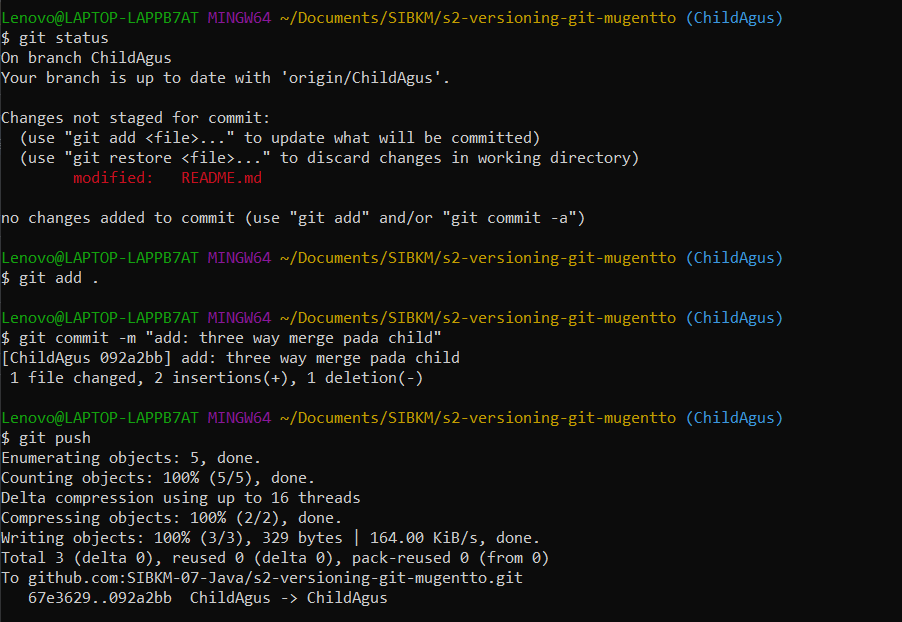

FAST FORWARD
1. Inisialisai Direktori

Melakukan pemindahan direktori ke folder yang ingin kita tuju. Melakukan pengenalan direktori dengan git (git init) 
2. Penambahan README.md

Setelah file readme berhasil kita buat maka status file Untracked file, hal itu terjadi jika ada file yang ditambah atau dihapus selanjutnya kita melakukan add dan commit untuk memakukan ke git lokal
HASIL

3. Pembuatan Branch Parent dan Child

Pada kasus ini master dan Parent memenuhi peran yang sama maka hanya perlu di rename saja, sedangkan Child perlu membuat dari awal
4. Perubahan file pada child

Setelah terjadi perubahan pada file dilakukan add dan commit kedalam ChildAgus
5. Merge

Berpindah branch ke Parent dan melakukan pengabungan atau merge dengan branch Child serta hasil FAST FORWARD sudah nampak.

REMOTE SERTA PUSH KE ORGANISASI
1. Push ParentAgus

inisialisai repositori organisasi dengan remote. Melakukan push pada branch parent
2. Push ChildAgus

Melakukan push pada branch child

THREE WAY MERGE
1. git clone

Melakukan clone dan menyiapkan direktori hasil clone
2. Menampilkan branch tersembunyi

Menampilkan kembali branch parent dan child
3. Three Way Merge pada child

Setelah melakukan perubahan maka dilakukan add,commit, dan push
4. Three Way Merge pada parent

Setelah melakukan perubahan maka dilakukan add,commit, dan push
5. Melakukan pull seolah olah conflict

pilih tindakan yang diminati dan di merge di visual studio
6. Commit hasil penanganan conflict

hasil penanganan conflict di vs code di commit 
7. Push ke git remote

8. melakukan pull pada parent dan melihat log

9. hasil pull request
